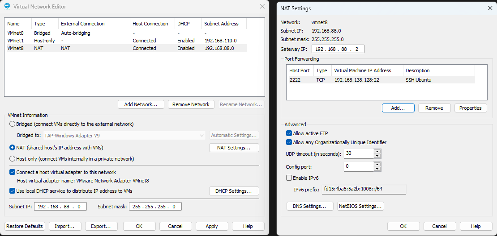

# Guide VMware Ubuntu Server - Configuration Réseau et SSH

## 1. Configuration du réseau VMware

### Étape 1.1 : Vérification et démarrage des services VMware

**Ouvrir PowerShell en administrateur :**

```powershell
# Windows + X → "Windows PowerShell (Admin)"
```

**Vérifier les services VMware :**

```powershell
Get-Service -DisplayName "*VMware*"
```

**Démarrer les services nécessaires :**

```powershell
Start-Service -DisplayName "VMware Authorization Service"
Start-Service -DisplayName "VMware DHCP Service"
```

**Vérifier que tous les services sont démarrés :**

```powershell
Get-Service -DisplayName "*VMware*"
```

### Étape 1.2 : Lancer VMware en administrateur

```powershell
# Fermer VMware s'il est ouvert
Stop-Process -Name "vmware*" -Force -ErrorAction SilentlyContinue

# Lancer VMware Workstation en administrateur
Start-Process "C:\Program Files (x86)\VMware\VMware Workstation\vmware.exe" -Verb RunAs
```

### Étape 1.3 : Configuration du port forwarding


**Dans VMware Workstation :**

1. **Edit** → **Virtual Network Editor**
2. Sélectionnez **VMnet8** (NAT)
3. Cliquez sur **NAT Settings**
4. Cliquez sur **Advanced**
5. Cliquez sur **Port Forwarding**
6. Cliquez sur **Add** (ou bouton +)

**Paramètres de la règle :**

- **Host port** : `2222`
- **Type** : `TCP`
- **Virtual machine IP address** : `192.168.138.128`
- **Virtual machine port** : `22`
- **Description** : `SSH Ubuntu`

**Validation :**

- Cliquez **OK** pour sauvegarder la règle
- Cliquez **OK** pour fermer NAT Settings
- Cliquez **Apply** dans Virtual Network Editor

## 2. Installation de la VM Ubuntu

### Étape 2.1 : Création de la VM

**Lors de la création de la VM :**

1. Suivez l'assistant de création
2. **À l'étape réseau, sélectionnez OBLIGATOIREMENT : Custom**
3. **Choisissez : NAT (VMnet8)**

**⚠️ IMPORTANT : Sélectionnez Custom puis NAT (VMnet8) pour utiliser la configuration réseau créée précédemment !**

### Étape 2.2 : Installation Ubuntu Server

Procédez à l'installation normale d'Ubuntu Server.

## 3. Configuration post-installation

### Étape 3.1 : Vérification de l'interface réseau

**Vérifier les interfaces réseau :**

```bash
ip addr show
```

**Vérifier l'IP de la VM :**

```bash
hostname -I
```

### Étape 3.2 : Test de connectivité Internet

**Tester la connexion Internet :**

```bash
ping -c 4 google.com
```

**Tester la résolution DNS :**

```bash
nslookup google.com
```

### Étape 3.3 : Installation des outils réseau

**Mettre à jour les paquets :**

```bash
sudo apt update
sudo apt upgrade -y
```

**Installer net-tools :**

```bash
sudo apt install net-tools -y
```

**Installer des outils réseau utiles :**

```bash
sudo apt install curl wget traceroute -y
```

### Étape 3.4 : Configuration SSH

**Installer le serveur SSH :**

```bash
sudo apt install openssh-server -y
```

**Activer et démarrer SSH :**

```bash
sudo systemctl enable ssh
sudo systemctl start ssh
```

**Vérifier le statut SSH :**

```bash
sudo systemctl status ssh
```

**Vérifier que SSH écoute sur le port 22 :**

```bash
sudo netstat -tlnp | grep :22
```

**Ou avec ss :**

```bash
sudo ss -tlnp | grep :22
```

### Étape 3.5 : Configuration du firewall (optionnel)

**Activer le firewall et autoriser SSH :**

```bash
sudo ufw enable
sudo ufw allow ssh
sudo ufw status
```

## 4. Tests de connexion

### Étape 4.1 : Vérifications sur la VM

**Vérifier l'IP de la VM :**

```bash
ip addr show
```

**Vérifier la route par défaut :**

```bash
ip route show
```

**Vérifier les interfaces avec net-tools :**

```bash
ifconfig
```

**Tester la connectivité sortante :**

```bash
curl -I http://google.com
```

### Étape 4.2 : Test SSH depuis l'hôte Windows

**Depuis Windows (PowerShell ou CMD) :**

```cmd
ssh -p 2222 username@localhost
```

**Ou avec l'IP de loopback :**

```cmd
ssh -p 2222 username@127.0.0.1
```

**Remplacez `username` par votre nom d'utilisateur Ubuntu.**

### Étape 4.3 : Vérifications supplémentaires

**Vérifier que le port 2222 est ouvert sur Windows :**

```cmd
netstat -an | findstr 2222
```

**Tester la connexion avec verbose :**

```cmd
ssh -v -p 2222 username@localhost
```

## 5. Dépannage

### Si SSH ne fonctionne pas :

**Vérifier l'IP réelle de la VM :**

```bash
hostname -I
```

**Ajuster le port forwarding :**

- Retournez dans VMware → Virtual Network Editor → VMnet8 → NAT Settings → Advanced → Port Forwarding
- Modifiez l'IP de la VM avec la vraie IP obtenue

**Redémarrer les services VMware :**

```powershell
Restart-Service -Name "VMware NAT Service"
```

### Si Internet ne fonctionne pas :

**Vérifier la configuration réseau :**

```bash
cat /etc/netplan/*.yaml
```

**Redémarrer le réseau :**

```bash
sudo netplan apply
```

## 6. Résultat final

**✅ VM Ubuntu avec accès Internet**
**✅ Connexion SSH depuis Windows : `ssh -p 2222 username@localhost`**
**✅ Configuration sécurisée avec isolation réseau**

---

**Notes importantes :**

- Toujours utiliser Custom → NAT (VMnet8) lors de la création
- L'IP par défaut VMware est souvent 192.168.138.128
- Le port SSH par défaut est 22, mappé sur 2222 côté hôte
- Pensez à noter l'IP réelle de votre VM pour ajuster si nécessaire
